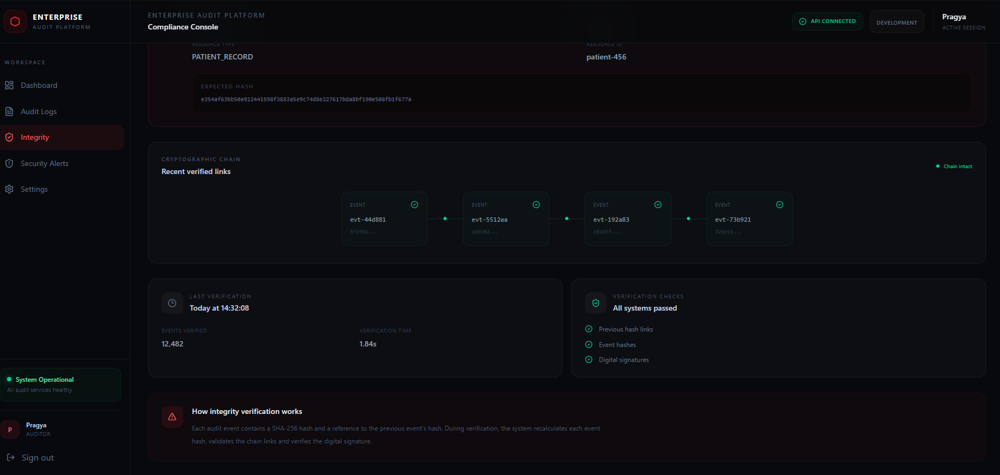
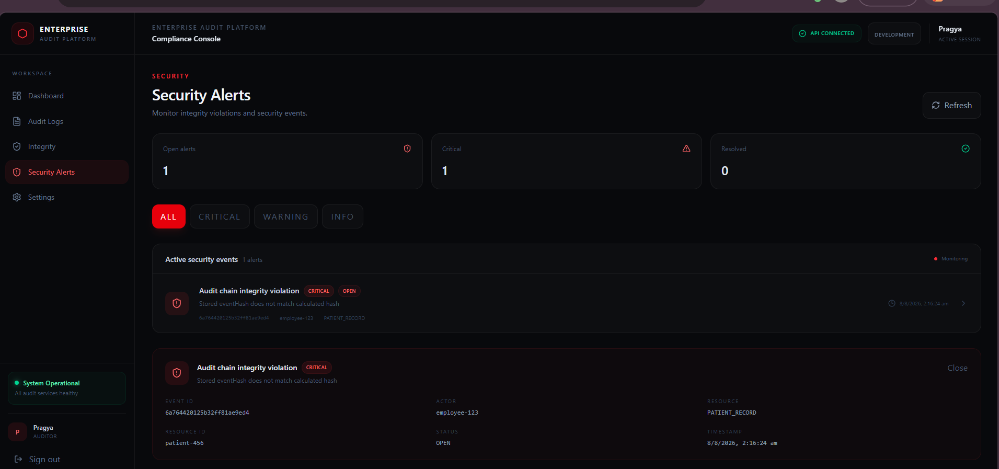
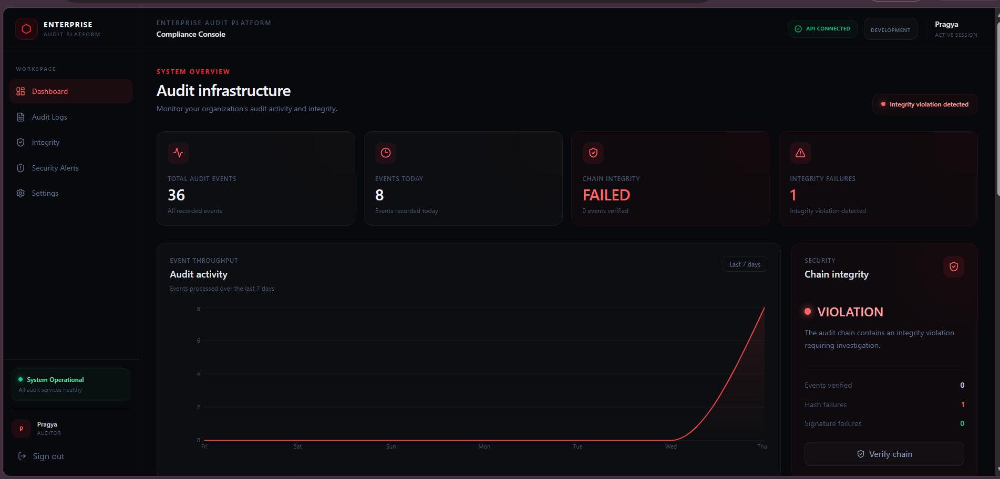
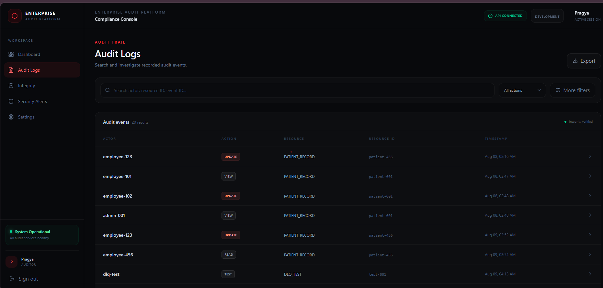

<h1>Enterprise Audit Logging & Compliance Platform</h1>

  <strong>Secure • Tamper-Evident • Asynchronous • Compliance-Ready</strong>

  An enterprise-grade audit logging platform designed to provide secure,
  tamper-evident, searchable and asynchronously processed audit records.

---

<h2>📌 Project Overview</h2>

The Enterprise Audit Logging & Compliance Platform provides a centralized
audit trail for recording, securing and investigating user and system
activity.

The platform is designed around five core principles:
<strong>security, integrity, asynchronous processing, searchability and
operational visibility.</strong>

Instead of coupling audit persistence directly to the primary business
operation, audit events are asynchronously processed through AWS SQS.
This allows the primary application to remain responsive while audit
records are independently processed and persisted.

---

<h2>🏗️ High Level System Design</h2>

The High Level System Design document provides a detailed overview of the
Enterprise Audit Logging & Compliance Platform, including its architecture,
component responsibilities, data flow, security model, persistence,
asynchronous processing, monitoring and AWS integration.

  <a href="src/main/resources/Enterprise_Audit_Platform_HLSD.docx">
    📄 <strong>View High Level System Design Document</strong>
  </a>

  <em>
    Enterprise Audit Platform — High Level System Design
  </em>

---

<h2>🔄 Audit Processing Flow</h2>

  

  <em>
    Audit events are submitted through the REST API and asynchronously
    processed using AWS SQS before being persisted to MongoDB.
  </em>

---

<h2>🔐 Tamper-Evident Audit Trail</h2>

  

Each audit event contains a cryptographic hash and a reference to the
previous event's hash.

This creates a chained sequence of events where modifying an earlier
record causes subsequent chain verification to fail.

  <strong>
    SHA-256 → Event Hash → Previous Hash → Chain Verification
  </strong>

---

<h2>🛡️ Authentication & Authorization</h2>

  

The platform uses Spring Security with JWT-based authentication and
role-based authorization.

<ul>
  <li>JWT authentication</li>
  <li>Role-based authorization</li>
  <li>USER, AUDITOR and ADMIN roles</li>
  <li>BCrypt password hashing</li>
  <li>JWT signature validation</li>
  <li>JWT role validation</li>
  <li>Login attempt rate limiting using Redis</li>
</ul>

---

<h2>📊 Monitoring & Operational Visibility</h2>

  

Spring Boot Actuator and Micrometer provide health checks and application
metrics for monitoring the audit pipeline and its dependencies.

The monitoring strategy focuses alerting on serious operational and
compliance events rather than generating excessive alert noise.

---

<h2>🚨 Serious Event Alerting</h2>

The platform is designed to alert only when an event requires operational
or compliance attention.

<ul>
  <li>🚨 Hash-chain verification failure</li>
  <li>🚨 Repeated audit-processing failures</li>
  <li>🚨 Dead-letter queue activity</li>
  <li>🚨 Audit archival failures</li>
</ul>

Normal application activity and individual transient failures are monitored
without generating unnecessary alerts.

---

<h2>✨ Key Features</h2>

<ul>
  <li>Centralized audit event ingestion</li>
  <li>Asynchronous audit processing using AWS SQS</li>
  <li>SHA-256 tamper-evident hash chaining</li>
  <li>Audit-chain verification and tamper detection</li>
  <li>MongoDB persistence</li>
  <li>MongoDB indexes for efficient querying</li>
  <li>Pagination and time-range filtering</li>
  <li>Actor, resource and action-based searching</li>
  <li>Redis-backed distributed locking</li>
  <li>Idempotent audit event processing</li>
  <li>JWT authentication</li>
  <li>Role-based authorization</li>
  <li>BCrypt password hashing</li>
  <li>Login rate limiting</li>
  <li>Spring Boot Actuator health monitoring</li>
  <li>Micrometer application metrics</li>
  <li>Compliance-focused audit investigation capabilities</li>
</ul>

---

<h2>🔎 Audit Investigation</h2>

The platform provides APIs for investigating audit activity across
multiple dimensions.

<table>
  <tr>
    <th>Investigation</th>
    <th>Description</th>
  </tr>
  <tr>
    <td>Actor</td>
    <td>Find all actions performed by a specific user</td>
  </tr>
  <tr>
    <td>Resource</td>
    <td>View the complete history of a resource</td>
  </tr>
  <tr>
    <td>Action</td>
    <td>Find all operations of a specific type such as UPDATE or DELETE</td>
  </tr>
  <tr>
    <td>Time Range</td>
    <td>Investigate activity during a specific period</td>
  </tr>
  <tr>
    <td>Combined Filters</td>
    <td>Filter by actor, resource, action and time range</td>
  </tr>
</table>

---

<h2>📡 API Overview</h2>

<table>
  <tr>
    <th>Method</th>
    <th>Endpoint</th>
    <th>Purpose</th>
  </tr>

  <tr>
    <td>POST</td>
    <td><code>/api/v1/auth/register</code></td>
    <td>Register a user</td>
  </tr>

  <tr>
    <td>POST</td>
    <td><code>/api/v1/auth/login</code></td>
    <td>Authenticate and obtain JWT</td>
  </tr>

  <tr>
    <td>POST</td>
    <td><code>/api/v1/audit-events</code></td>
    <td>Create an audit event</td>
  </tr>

  <tr>
    <td>GET</td>
    <td><code>/api/v1/audit-events</code></td>
    <td>Retrieve audit events</td>
  </tr>

  <tr>
    <td>GET</td>
    <td><code>/api/v1/audit-events/{id}</code></td>
    <td>Retrieve a specific audit event</td>
  </tr>

  <tr>
    <td>GET</td>
    <td><code>/api/v1/audit-events/search</code></td>
    <td>Search and filter audit events</td>
  </tr>

  <tr>
    <td>GET</td>
    <td><code>/api/v1/audit-events/paged</code></td>
    <td>Paginated audit event retrieval</td>
  </tr>

  <tr>
    <td>GET</td>
    <td><code>/api/v1/audit-events/verify</code></td>
    <td>Verify audit-chain integrity</td>
  </tr>
</table>

---

<h2>🧩 Technology Stack</h2>

<table>
  <tr>
    <th>Layer</th>
    <th>Technology</th>
  </tr>

  <tr>
    <td>Language</td>
    <td>Java 21</td>
  </tr>

  <tr>
    <td>Backend</td>
    <td>Spring Boot</td>
  </tr>

  <tr>
    <td>Security</td>
    <td>Spring Security, JWT, BCrypt</td>
  </tr>

  <tr>
    <td>Database</td>
    <td>MongoDB</td>
  </tr>

  <tr>
    <td>Messaging</td>
    <td>AWS SQS</td>
  </tr>

  <tr>
    <td>Distributed Locking</td>
    <td>Redis</td>
  </tr>

  <tr>
    <td>Monitoring</td>
    <td>Spring Boot Actuator, Micrometer</td>
  </tr>

  <tr>
    <td>Cloud</td>
    <td>AWS</td>
  </tr>

  <tr>
    <td>Build</td>
    <td>Maven</td>
  </tr>

  <tr>
    <td>Containerization</td>
    <td>Docker</td>
  </tr>
</table>

---

<h2>🔒 Security Model</h2>

Audit data is protected through multiple layers of authentication,
authorization and integrity controls.

<table>
  <tr>
    <th>Control</th>
    <th>Purpose</th>
  </tr>

  <tr>
    <td>JWT</td>
    <td>Authentication</td>
  </tr>

  <tr>
    <td>RBAC</td>
    <td>Authorization</td>
  </tr>

  <tr>
    <td>BCrypt</td>
    <td>Password protection</td>
  </tr>

  <tr>
    <td>SHA-256</td>
    <td>Tamper detection</td>
  </tr>

  <tr>
    <td>Redis</td>
    <td>Rate limiting and distributed locking</td>
  </tr>

  <tr>
    <td>AWS SQS</td>
    <td>Asynchronous processing</td>
  </tr>
</table>

---

<h2>📈 Performance Testing</h2>

Performance testing is treated as a measurement exercise rather than an
arbitrary throughput claim.

The system will be evaluated using progressively increasing audit-event
loads and measured using:

<ul>
  <li>Throughput</li>
  <li>p50 latency</li>
  <li>p95 latency</li>
  <li>p99 latency</li>
  <li>Error rate</li>
  <li>SQS processing delay</li>
  <li>MongoDB write performance</li>
</ul>

Final performance figures will be reported based on the actual test
environment and measured results.

---

<h2>🗺️ Development Roadmap</h2>

<table>
  <tr>
    <th>Phase</th>
    <th>Feature</th>
    <th>Status</th>
  </tr>

  <tr>
    <td>Phase 1</td>
    <td>Basic Audit Logging</td>
    <td>✅ Complete</td>
  </tr>

  <tr>
    <td>Phase 2</td>
    <td>Tamper-Evident Hash Chain</td>
    <td>✅ Complete</td>
  </tr>

  <tr>
    <td>Phase 3</td>
    <td>Asynchronous SQS Ingestion</td>
    <td>✅ Complete</td>
  </tr>

  <tr>
    <td>Phase 4</td>
    <td>Search & Compliance Queries</td>
    <td>✅ Complete</td>
  </tr>

  <tr>
    <td>Phase 5</td>
    <td>Immutable S3 Archival</td>
    <td>🚧 Planned</td>
  </tr>

  <tr>
    <td>Phase 6</td>
    <td>Security & Compliance Controls</td>
    <td>✅ Substantially Complete</td>
  </tr>

  <tr>
    <td>Phase 7</td>
    <td>Monitoring & Alerting</td>
    <td>🚧 In Progress</td>
  </tr>

  <tr>
    <td>Phase 9</td>
    <td>Performance & Load Testing</td>
    <td>🚧 Planned</td>
  </tr>
</table>

---

<h2>🎯 Project Objective</h2>

  <strong>
    Build an audit platform that is secure, tamper-evident,
    asynchronous, searchable and operationally observable.
  </strong>

  Designed with enterprise compliance, security and real-world
  operational scenarios in mind.

---

  <strong>Enterprise Audit Logging & Compliance Platform</strong>

  Java • Spring Boot • MongoDB • AWS SQS • Redis • Spring Security

